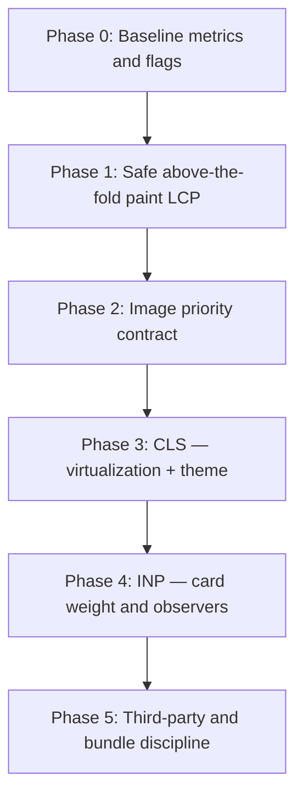

# Core Web Vitals — Consolidated Audit & Incremental Fix Playbook

**Status:** Planning / execution reference  
**Stack:** React 19 + Vite 7 SPA (client-rendered unless otherwise noted)  
**Goal:** Improve **LCP**, **INP**, and **CLS** without introducing regressions via “local optimizations” that break architecture, UX, or maintainability.

This document merges two audits of the same codebase and turns them into **ordered, dependency-aware work** plus **instructions for humans and LLMs** so fixes stay **incremental**, **measurable**, and **root-cause oriented**.

---

## 1. Why we are not doing “myopic” fixes

**Myopic change:** A one-line tweak (e.g. delete all animations) that improves one lab number but:

- harms accessibility, perceived quality, or layout invariants;
- duplicates logic across card variants;
- fights existing architecture (e.g. `ImageLayer` vs `CardMedia` vs `Image`);
- increases bandwidth or main-thread work elsewhere (e.g. eager-load every image);
- ships without before/after metrics on the **same** page, device profile, and cache mode.

**This playbook instead requires:**

1. **One primary metric target per PR** (LCP *or* CLS *or* INP), with **guardrails** on the other two (must not regress beyond a small agreed threshold).
2. **Evidence before merge:** lab trace or Lighthouse diff + note of what changed in the render path.
3. **Scope control:** touch only the files and abstractions listed for that work item; if scope creeps, split a new work item.
4. **Rollback clarity:** each item states what to revert if behavior or metrics regress.

---

## 2. Executive summary (consolidated)

| Area | Primary drivers (code-proven) | Strategic ceiling |
|------|------------------------------|-------------------|
| **LCP** | Client-only shell: `index.html` → blocking `index.css` → `main.tsx` bundle → lazy `HomePage` chunk → React Query feed → **card thumbnails**. **Feed cells use `animate-fade-in-up` starting at `opacity: 0`** (Tailwind). **`CardMedia` uses `loading="lazy"`** on hero thumbnails with **no `fetchPriority`**. | Without SSR/edge HTML or server-driven preload of the true LCP image, LCP stays **bound to JS + API + image discovery**. |
| **INP** | Deep **provider tree**, **`NewsCard` mounting many modal/portals per card**, **desktop grid intentionally non-virtualized** (`columnCount > 1`), optional **`useYouTubeTitle` oEmbed** fan-out, **Sentry Browser Tracing + Replay** when DSN enabled. | Needs **structural** reductions (singleton modals, lighter card shell, selective Sentry) for large INP wins. |
| **CLS** | **Virtual row estimator uses 4:3** in `estimateHomeGridRowHeightPx` while **`CardMedia` defaults to 16:9** (when `HOME_FEED_VIRTUALIZATION` is on). **Dark mode** applied in `useEffect` after first paint (`App.tsx`). **CMS intro** (`PublicHomeIntro`) can change line layout when copy arrives. | Fix estimator + theme strategy; validate virtualization path separately from grid path. |

**Third parties / head:** Plausible (`async` + inline `plausible.init`), preconnect hints for API/YouTube — lower risk than feed behavior but still worth profiling.

---

## 3. Guiding principles for incremental, deep work

### 3.1 Order of operations (dependency graph)

Execute in **phases**. Do not skip validation gates between phases.



- **Phase 1** is intentionally **behavior-preserving** for below-the-fold UX (stagger/animation can remain for off-screen rows).
- **Phase 2** adds an explicit **“hero tile” contract** so LCP and bandwidth tradeoffs are centralized, not scattered `if (index < 6)` in five files forever.
- **Phase 3** fixes **measurement truth** (row height) and **document-level** CLS (theme) without mixing in LCP image changes in the same PR if possible.
- **Phase 4** is the heaviest **refactor** risk — only after LCP/CLS baselines are stable.

### 3.2 Definition of Done (per work item)

- [ ] **Before:** Lighthouse mobile (or DevTools trace) snapshot saved (JSON/HTML) with **LCP element**, **CLS**, **INP** (or long tasks if INP lab not available).
- [ ] **After:** Same conditions repeated; **primary metric** improved; **guardrails** documented.
- [ ] **Tests:** Existing Vitest unaffected; add/adjust tests if logic is non-trivial (e.g. new props on `Image`).
- [ ] **Feature flags:** If behavior is risky, gate behind existing env patterns (`VITE_*`) or a single new flag documented here.

---

## 4. Issues catalog — deep dive (root → fix → risk → validation)

Each row is **one coherent problem**. Implement as **small PRs** mapped to phases above.

---

### CW-01 — Entrance animation hides first paint (`opacity: 0`)

**Symptom:** Lab LCP and “time to readable feed” lag; screenshots show cards faded in late.

**Evidence:**

- Tailwind keyframes `fade-in-up`: `0% { opacity: 0; transform: translateY(10px) }` (`tailwind.config.js`).
- Applied in **`ArticleGrid`** (non-virtualized grid) with `animate-fade-in-up` and **`index * 50` ms delay** (max 750 ms within `staggerCapIndex`).
- Applied in **`HomeGridVirtualized`** with `flatIndex`-based delay and animation for indices ≤ `staggerCapIndex`.
- **`MasonryGrid`**: combines `opacity-0`/`opacity-100` with the same fade animation when content appears.

**Root cause:** Largest contentful candidates (often **thumbnail `img`** or large text blocks) remain **transparent or delayed** until the CSS animation progresses; staggering adds **interaction delay** perception on mobile.

**Deep fix options (best → fallback):**

1. **Recommended:** Skip `animate-fade-in-up` (and **`animationDelay`**) only for **strictly above-the-fold** tiles using a single rule:  
   `flatIndex/index < PRIORITY_CARD_COUNT` where `PRIORITY_CARD_COUNT = f(gridColumnCount)` (e.g. `min(gridColumnCount * 2, 8)`).
2. **Alternative:** Replace global `fade-in-up` with **`@media (prefers-reduced-motion: reduce)`** full bypass (already partly via `motion-reduce:` — extend to disable transform for perf tier if needed — **needs design agreement**).
3. **Avoid as first step:** Removing all animations globally — **derivative effect:** UX regression, stakeholder pushback.

**Risks / derivative effects:** Fewer animations on first row only is usually safe; ensure **CLS** unaffected (animations use transform/opacity; layout already reserved by aspect containers).

**Validation:** Lighthouse LCP phases; Performance panel screenshots — first opaque frame on card media.

---

### CW-02 — Hero thumbnails always `loading="lazy"` (`Image` + `CardMedia`)

**Symptom:** LCP image request starts later than necessary; contention with many lazy images.

**Evidence:**

- `src/components/Image.tsx`: default `loading="lazy"`.
- `src/components/card/atoms/CardMedia.tsx`: passes `loading="lazy"` explicitly on the main thumbnail `<Image>`.

**Root cause:** No distinction between **in-viewport LCP candidates** vs **below-fold** tiles.

**Deep fix:**

1. Extend `Image` to accept **`loading?: 'lazy' | 'eager'`** (default `'lazy'`) and **`fetchPriority?: 'high' | 'low' | 'auto'`**.
2. Plumb **`isPriorityThumbnail`** from **`ArticleGrid` / `HomeGridVirtualized`** (same `PRIORITY_CARD_COUNT` as CW-01) through **`NewsCard` → `GridVariant` → `CardMedia`** (and masonry equivalent if masonry is priority for some routes — **explicit decision**).

**Risks / derivative effects:**

- **`fetchPriority="high"` on too many imgs** hurts bandwidth fairness — **cap** strictly (e.g. first 4–8).
- **Masonry:** different column balancing — prioritize only **globally smallest globalIndex** subset.

**Validation:** Network panel — LCP image request start time vs `navigationStart`; Lighthouse “preload LCP” hint should not be required after this.

---

### CW-03 — SPA sequential critical path (blocking CSS + lazy route)

**Symptom:** Time-to-first-feed dominated by stylesheet + bundles + chunk + API.

**Evidence:**

- `index.html`: `<link rel="stylesheet" href="/index.css">` (blocking).
- `App.tsx`: `HomePage` is `React.lazy(...)`.
- `main.tsx`: full provider stack + `initSentry()` before paint.

**Root cause:** No server-rendered HTML for feed; all content behind JS.

**Deep fix tiers:**

1. **Low risk:** After shell mount, **prefetch** `HomePage` chunk (`import('@/pages/HomePage')` in `requestIdleCallback` or post-`requestAnimationFrame`) — small win, no UX change.
2. **Medium:** Critical CSS split / reduce unused Tailwind surface — **measure** `index.css` transfer size first.
3. **High (architectural):** SSR/streaming or edge cached shell — **separate initiative**; document dependencies (API shape, auth cookies).

**Risks:** Prefetch can compete with LCP image bytes — **gate** prefetch behind “feed API in flight” or idle.

**Validation:** Trace “First Contentful Paint” vs “LCP”; script evaluation time.

---

### CW-04 — Auth bootstrap vs feed (`AuthContext` + `useInfiniteArticles`)

**Symptom:** Main thread and network busy during critical window.

**Evidence:** `AuthProvider` runs `authService.getCurrentUser()` on mount; `HomePage` runs `useInfiniteArticles` and other queries in parallel.

**Root cause:** Not strictly serial, but **aggregate** work and re-renders when auth resolves can shift layout or reprioritize work.

**Deep fix:** **Needs validation** with React Profiler — if confirmed costly:

- Ensure feed query **does not wait** on auth unless required (already rationale in code for anonymous).
- Avoid **large context value churn** on auth transition (memoization / split stores — **only if measured**).

**Validation:** Profiler flame chart on cold load; count re-renders of `ArticleGrid` between auth start/end.

---

### CW-05 — Virtualization row height **4:3** vs card media **16:9**

**Symptom:** Scroll jank, layout correction, CLS when `VITE_HOME_FEED_VIRTUALIZATION=true`.

**Evidence:**

- `src/utils/homeGridVirtualization.ts`: `imageHeight = cellWidth * (3/4)`.
- `CardMedia`: default `aspectRatio: '16/9'` for typical media.

**Root cause:** **Wrong physical model** for virtualizer estimate; `measureElement` fixes eventually but **late correction = user-visible instability**.

**Deep fix:** Single source of truth:

- Change estimator to **`cellWidth * (9/16)`** **or** import a shared constant **CARD_MEDIA_ASPECT** used by both estimator and `CardMedia` defaults (best long-term).

**Risks:** Cards with **documents**, **multi-image grid**, or **exceptions** still vary height — estimator remains approximate; **measureElement** remains necessary — do not remove.

**Validation:** CLS panel + scroll while virtualized; compare with flag off.

---

### CW-06 — Dark mode applied after first paint

**Symptom:** Flash, late recalc, possible CLS for dark-preference users.

**Evidence:** `App.tsx`: `useState(false)` + `useEffect` + `document.documentElement.classList`.

**Root cause:** Theme is **client-only effect**, not synced before paint.

**Deep fix tiers:**

1. **Inline blocking script** in `index.html` (before CSS) reads `prefers-color-scheme` or `localStorage` and sets `.dark` on `<html>` — **minimal CLS** fix.
2. Align with future “saved theme” in **cookie** if SSR ever appears.

**Risks:** Must match **`AuthProvider` / user preference** precedence — **single owner** for theme source of truth (system vs saved).

**Validation:** CLS on first navigation; throttle CPU; filmstrip screenshot.

---

### CW-07 — CMS micro-header swap (`PublicHomeIntro`)

**Symptom:** Small CLS when remote copy lands.

**Evidence:** `useQuery` for `onboardingCopyService.fetchMicroHeaderBundle()` when `!isAuthenticated`.

**Root cause:** Height change in intro block without reserved space.

**Deep fix:** `min-height` on intro container or skeleton lines; reserve **two lines** of text.

**Validation:** CLS attributable to intro node; throttle network.

---

### CW-08 — Modal-heavy **`NewsCard`**

**Symptom:** INP/long tasks when interacting with feed; heavy memory/DOM.

**Evidence:** One `NewsCard` mounts **`CollectionPopover`**, **`ReportModal`**, **`ImageLightbox`**, **`ArticleModal`**, dual **`CreateNuggetModalLoadable`**, **`LinkPreviewModal`** — gated by booleans but still in React tree hooks.

**Root cause:** **Per-card subtree** duplication.

**Deep fix phases (incremental):**

1. Measure: React Profiler — **why did this render?** on pointer interaction.
2. **Extract singleton modals** at layout (`App` or `FeedSurface`) driven by **`activeArticleId`** / **`modalKind`** (**larger refactor** — separate epic).
3. Short-term mitigation: **`lazy`** inner modal chunks only helps code size, not always instance count — prioritize **singleton** approach.

**Risks:** Risk of breaking **popover anchors** (`anchorRect`) when moving portals — thorough QA.

**Validation:** Interaction → longest task correlation in Performance; Profiler commit time.

---

### CW-09 — Desktop grid non-virtualized + virtualization flag default off

**Symptom:** Many DOM nodes on large screens; scroll/pointer contention.

**Evidence:** `ArticleGrid.tsx` — virtualization only when `HOME_FEED_VIRTUALIZATION` && grid && `gridColumnCount === 1`; multi-column desktop uses full map.

**Root cause:** **Product tradeoff**: layout fidelity vs performance.

**Deep fix:** **Not** enabling desktop virt without Phase 3 CLS truth (CW-05) validated; prototype behind flag.

**Validation:** FPS, long tasks during scroll on 4-column layout.

---

### CW-10 — Sentry Replay + Browser Tracing

**Symptom:** Main-thread overhead; long tasks tied to instrumentation.

**Evidence:** `sentry.ts` registers `browserTracingIntegration` + `replayIntegration` + sample rates.

**Root fix:** Separate **telemetry PR**:

- Reduce `replaysSessionSampleRate` on mobile; lazy-load Replay; disable Replay on **`navigator.connection.saveData`**.

**Risks:** Less observability — **explicit product decision**.

**Validation:** Compare long tasks with DSN temporarily unset (local-only) vs enabled.

---

### CW-11 — Third-party: Plausible

**Symptom:** Parse/eval contention on slow devices.

**Evidence:** `index.html` — async external script + inline init.

**Deep fix:** Defer inline init behind `DOMContentLoaded` or `requestIdleCallback` **only if** Plausible semantics allow (verify docs — **needs validation**).

---

## 5. Consolidated prioritized backlog (piecemeal roadmap)

Use this as **sprint backlog order**; link PRs to **CW-xx** IDs.

| Priority | ID | Phase | Title | Estimated risk |
|----------|-----|-------|-------|----------------|
| P0 | CW-01 | 1 | Skip fade-in only for above-the-fold feed cells | Low |
| P1 | CW-02 | 2 | Priority thumbnail loading API (`eager` + `fetchPriority` cap) | Low–medium |
| P2 | CW-06 | 3 | Inline theme sync before paint | Medium (precedence rules) |
| P3 | CW-05 | 3 | Unify virtualization row estimate with card aspect | Low |
| P4 | CW-07 | 3 | Reserve height for CMS intro | Low |
| P5 | CW-03 | 1–2 | HomePage chunk prefetch (idle) | Low |
| P6 | CW-08 | 4 | Singleton modals refactor (EPIC — split tickets) | High |
| P7 | CW-10 | 5 | Sentry sampling / deferred Replay | Medium |
| — | CW-09 | 4 | Desktop virtualization (flagged) | High |
| — | CW-04 | 4 | Auth re-render reduction | **Needs validation first** |

---

## 6. Instructions for LLMs working on this plan

Paste or reference **`docs/CORE_WEB_VITALS_INCREMENTAL_FIX_PLAYBOOK.md`** when asking an LLM to implement fixes. Require the LLM to follow:

### 6.1 Mandatory pre-read

- **Read** affected files fully (not only snippets): especially **`ArticleGrid.tsx`**, **`HomeGridVirtualized.tsx`**, **`CardMedia.tsx`**, **`Image.tsx`**, **`MasonryGrid.tsx`**, **`App.tsx`**, **`homeGridVirtualization.ts`** before editing.
- **Respect architecture notes** in `App.tsx` (Header/layout invariants); do **not** move Header or break overlay hosts.

### 6.2 One PR = one CW-ID (default)

- If a PR addresses **CW-01**, do **not** also change **`estimateHomeGridRowHeightPx`** unless explicitly bundling CW-05 with a clear title and separate commits.
- If two CWs **must** ship together (e.g. CW-01 + CW-02 share **`PRIORITY_CARD_COUNT`**), introduce **one shared constant file** `src/constants/aboveFoldPriority.ts` (name illustrative) exported as **single source of truth**.

### 6.3 No drive-by refactors

- Follow project rule: minimal diff; no unrelated formatting/moves.
- Do **not** replace `CardMedia` with `ImageLayer` globally in one shot — **different surfaces** have different contracts; consolidate only with a planned migration table.

### 6.4 Tradeoffs must be documented in the PR description

- Example: *“Increasing `PRIORITY_CARD_COUNT` from 4 → 12 may hurt LCP on congested Mobile Safari due to contention”* — then **reject** unless measured.

### 6.5 Verification checklist (LLM must list in PR)

- Lighthouse mobile before/after (or why not runnable).
- LCP element type (`IMG`/`TEXT`/other).
- CLS total.
- Confirmation that **motion-reduce** paths still behave.

### 6.6 When stuck between LCP vs INP

- **Above-the-fold `fetchPriority`:** favors **LCP**; may modestly delay other requests — **bound the count**.
- **Singleton modals:** favors **INP**; touches many files — **epic**.
- Never “fix INP” by **disabling virtualization** or **loading full feed** unless product-approved.

---

## 7. References (source files cited across both audits)

| Topic | Files |
|------|-------|
| HTML / head | `index.html` |
| Bootstrap | `src/main.tsx`, `src/App.tsx` |
| Lazy route | `src/App.tsx` (`HomePage` lazy) |
| Feed shell | `src/pages/HomePage.tsx`, `src/hooks/useInfiniteArticles.ts` |
| Grid / virt | `src/components/ArticleGrid.tsx`, `src/components/feed/HomeGridVirtualized.tsx`, `src/utils/homeGridVirtualization.ts`, `src/constants/featureFlags.ts` |
| Masonry | `src/components/MasonryGrid.tsx` |
| Card media / image | `src/components/card/atoms/CardMedia.tsx`, `src/components/Image.tsx`, `src/components/feed/ImageLayer.tsx` |
| Animations | `tailwind.config.js` |
| Cards / modals | `src/components/NewsCard.tsx`, `src/hooks/useNewsCard.ts` |
| Theme | `src/App.tsx` |
| Observability | `src/utils/sentry.ts` |
| React Query defaults | `src/queryClient.ts` |

---

## 8. Appendix — Metrics to record (template)

```
Date:
Branch:
URL (local/port or staging):
Throttle: Lighthouse mobile / CPU 4x / Slow 4G (specify)

LCP: ___ s | Element:
INP (field or lab proxy): ___ / long tasks >50ms count ___
CLS: ___

Notes:
```

---

**End of playbook.** Update this doc when CW-xx items complete; add `[x]` links to PRs next to backlog rows when your team adopts that convention.
