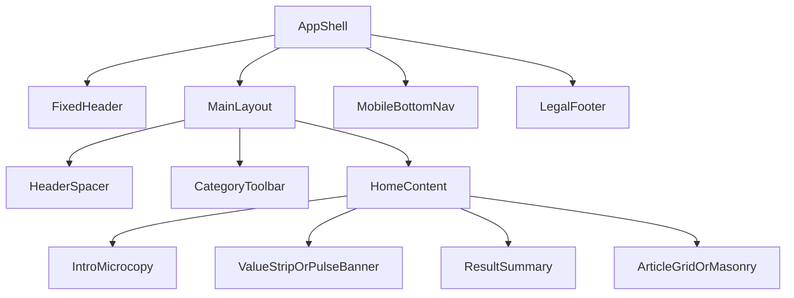

# Homepage UI Replication Specification (Current UI Fidelity)

## Replication Objective

Reproduce the current homepage UI as implemented in the active app route with very high visual fidelity. This is a **replication brief**, not a redesign brief.

### Must Match Exactly
- Overall page composition and section order from fixed header through footer.
- Header structure, nav labels, icon-only controls, and active/inactive visual states.
- Home intro microcopy placement, value strip/banner treatment, and result summary placement.
- Sticky category toolbar behavior, pill styles, divider rhythm, and chip placement.
- Card grid/masonry visual language (radius, border, shadow, spacing, text hierarchy, action row).
- Bottom mobile nav appearance, labels, active indicator, and safe-area behavior.
- Footer text hierarchy and legal-link placement.
- Motion timing/easing feel for major interactions (header hide/show, hover transitions, overlay fades).

### Can Be Improved Later (Do Not Change During Replication)
- Internal implementation details (query orchestration, telemetry, preload strategy).
- Accessibility enhancement opportunities beyond current behavior.
- Performance optimizations and virtualization internals.
- Minor refactors to CSS architecture or class composition, as long as rendered output remains equivalent.

## Source of Truth Files

Use these as canonical references for replication:
- Route + shell composition: [`src/App.tsx`](src/App.tsx)
- Homepage content structure: [`src/pages/HomePage.tsx`](src/pages/HomePage.tsx)
- Header (desktop/mobile): [`src/components/Header.tsx`](src/components/Header.tsx)
- Category toolbar: [`src/components/CategoryToolbar.tsx`](src/components/CategoryToolbar.tsx)
- Article grid shell: [`src/components/ArticleGrid.tsx`](src/components/ArticleGrid.tsx)
- Primary card variant: [`src/components/card/variants/GridVariant.tsx`](src/components/card/variants/GridVariant.tsx)
- Mobile bottom nav: [`src/components/navigation/MobileBottomNav.tsx`](src/components/navigation/MobileBottomNav.tsx)
- Footer: [`src/components/legal/LegalFooter.tsx`](src/components/legal/LegalFooter.tsx)
- Layout constants: [`src/constants/layout.ts`](src/constants/layout.ts)
- Global CSS + utilities: [`index.css`](index.css)
- Tailwind token extension: [`tailwind.config.js`](tailwind.config.js)

### Screenshot-Validated Fidelity Notes

Validated against provided desktop screenshot reference:
- Header appears compact, with a light/translucent shell and subdued contrast (avoid heavy borders or dark chrome).
- Category toolbar pills are tight in height and spacing; keep rail visually slim and dense.
- Homepage title/subtitle block is intentionally understated (small heading, muted support text, low visual prominence).
- Card area uses a strict four-column desktop rhythm with consistent gutter spacing and balanced card heights.
- Cards are light-surface, subtly bordered, and softly elevated; avoid increasing shadow intensity or radius beyond current feel.
- `View Full Article` is a quiet, low-emphasis action and should remain visually secondary to content.
- Overall tone is information-dense and editorial, not marketing-style; preserve restraint in contrast, size jumps, and decorative effects.

## Page Inventory (Top → Bottom)

1. **Fixed Global Header**
   - Purpose: app-level navigation, search, filtering, sorting, view toggle, auth utilities.
   - Hierarchy: highest persistent chrome (z-layer above content).
   - Layout pattern: single-row desktop toolbar (`lg+`), compact action row on mobile/tablet (`<lg`).
   - Viewport position: fixed top, always present on homepage.

2. **Header Spacer / Toolbar Transition Zone**
   - Purpose: reserve space for fixed header and avoid overlap.
   - Hierarchy: invisible structural spacer.
   - Layout pattern: block spacer matching header height.
   - Position: directly below fixed header.

3. **Homepage Intro Microcopy (anonymous only)**
   - Purpose: concise product framing (title + support line).
   - Hierarchy: first visible content text block.
   - Layout pattern: single-column text.
   - Position: near top of content stack, just below chrome.

4. **Dismissible Value Strip / Pulse Intro Banner (anonymous only)**
   - Purpose: onboarding/value proposition.
   - Hierarchy: high-emphasis informational strip.
   - Layout pattern: full-content-row banner with dismiss icon.
   - Position: directly under microcopy.

5. **Result Summary Line**
   - Purpose: status/count/search feedback.
   - Hierarchy: low-visual-weight metadata line.
   - Layout pattern: single-line text status row.
   - Position: immediately above card feed.

6. **Sticky Category Toolbar (conditional)**
   - Purpose: primary format/domain filter rail and active chips.
   - Hierarchy: secondary sticky chrome under header.
   - Layout pattern: horizontal scroller + pills + hover arrows (desktop).
   - Position: pinned below header region when active.

7. **Main Article Feed Section**
   - Purpose: primary content consumption.
   - Hierarchy: dominant visual weight area.
   - Layout pattern: responsive card grid (1/2/3/4 columns) or masonry mode.
   - Position: central body, full scrollable content.

8. **Overlays in Feed Context**
   - Purpose: transient interactions (pull-to-refresh, refetch overlays, modal/drawer article detail).
   - Hierarchy: elevated above feed; below/around global chrome depending layer.
   - Layout pattern: centered overlays, drawers, modals.
   - Position: contextual over feed area.

9. **Mobile Bottom Navigation (`lg:hidden`)**
   - Purpose: primary destination switching on narrow viewports.
   - Hierarchy: fixed bottom chrome.
   - Layout pattern: 2–3 tab grid with icon+label.
   - Position: fixed bottom with safe-area inset.

10. **Legal Footer**
   - Purpose: legal attribution and policy links.
   - Hierarchy: terminal low-emphasis section.
   - Layout pattern: centered/flex split copyright + links.
   - Position: page bottom after main content.

## Annotated Visual Breakdown

### 1) Fixed Header
- Container width: full viewport width; inner horizontal padding 16px mobile / 24px desktop.
- Grid/columns: desktop split into left (menu+logo), center (nav + search), right (tools/actions).
- Spacing: header height 56px mobile, 64px desktop (from layout constants).
- Alignment: vertical center; nav and tools aligned to baseline center.
- Visual weight: medium-high due to border, blur, and fixed presence.
- Background: translucent white (`bg-white/80`) / dark slate (`dark:bg-slate-900/80`) with `backdrop-blur-md`.
- Border/shadow/radius: bottom border only; pills/buttons use rounded md/full; subtle shadows on active tabs.
- Adjacency: overlays body content; requires explicit spacer beneath.

### 2) Intro Microcopy
- Container width: constrained by content region (`max-w-[1800px]` parent), text max `~62ch` at some breakpoints.
- Columns: single.
- Spacing: tiny top/bottom rhythm (`pt-0.5`, `mb-0.5`, paragraph `mt-0.5`).
- Alignment: left-aligned.
- Visual weight: low-to-medium (small text, muted support line).
- Background: transparent.
- Border/shadow/radius: none.
- Adjacency: directly precedes onboarding strip.

### 3) Value Strip / Pulse Intro Banner
- Container: horizontal margin 16px mobile / 24px desktop.
- Columns: single, with absolute dismiss icon at top-right.
- Spacing: `px-4 py-3`, `mb-3`; title-to-body gap `~2px` (`mt-0.5`).
- Alignment: left text, optional leading icon for pulse variant.
- Visual weight: medium via warm gradient and border.
- Background: yellow/amber or amber/orange linear gradient.
- Border/shadow/radius: 1px border with alpha, `rounded-xl`, no heavy shadow.
- Adjacency: follows intro, precedes summary/feed.

### 4) Result Summary Row
- Container: same feed horizontal padding as cards (`px-4 lg:px-6`).
- Columns: single line text status.
- Spacing: very tight (`mt-0.5 mb-2`).
- Alignment: left.
- Visual weight: low (10.5–11px text, muted slate tone).
- Background: transparent.
- Border/shadow/radius: none.
- Adjacency: immediate preface to feed cards.

### 5) Category Toolbar
- Container: full width with inner `max-w-[1800px]` + `px-4 lg:px-6`.
- Columns: single horizontal scroll lane; all pills inline.
- Spacing: fixed toolbar height 44px (`h-11`) visual bar.
- Alignment: center vertically, content aligned left inside scroll area.
- Visual weight: medium due to sticky placement and repeated pill controls.
- Background: `bg-white/95` / `dark:bg-slate-900/95` with blur.
- Border/shadow/radius: bottom border; pills are rounded-full with active ring/shadow.
- Adjacency: sits between header and feed content as secondary navigation.

### 6) Feed Grid (Default)
- Container width: full width up to `max-w-[1800px]`; centered.
- Columns: `1 / 2 / 3 / 4` at base / md / lg / xl.
- Gap: `gap-6` (~24px).
- Alignment: top-aligned cards, stretch rows.
- Visual weight: highest section.
- Background: page-neutral; cards carry surfaces.
- Border/shadow/radius: cards use `rounded-xl`, `border`, `shadow-sm` with `hover:shadow-md`.
- Adjacency: follows summary row and optional toolbar; precedes footer.

### 7) Mobile Bottom Nav
- Container: full width fixed bottom.
- Columns: 2 or 3 tabs depending feature flag.
- Spacing: min-height 64px + safe-area padding; each item min-height ~58px.
- Alignment: icon over label, centered.
- Visual weight: medium-high on mobile due to fixed placement.
- Background: translucent white/dark with blur and top shadow.
- Border/shadow/radius: top border, subtle top shadow; each tab rounded-xl.
- Adjacency: overlays lower viewport; footer adds bottom padding via CSS var.

### 8) Footer
- Container: `max-w-7xl`, horizontal paddings 16/24/32 by breakpoint.
- Columns: stacked mobile; split row on `sm+`.
- Spacing: `py-4 sm:py-5` with `gap-3` between blocks.
- Alignment: center mobile, justified split on wider screens.
- Visual weight: low.
- Background: solid white / dark slate.
- Border/shadow/radius: top border only.
- Adjacency: terminal section at end of scroll flow.

## Design Tokens Extraction

All values below are either explicit or inferred from class usage.

### Color Palette
- **Primary brand (explicit):** `primary-50..900` yellow scale in Tailwind config.
- **Neutrals (explicit via Tailwind slate/gray):**
  - Light surfaces: `white`, `gray-50/100`, `slate-100/200`.
  - Dark surfaces: `slate-900/950`, borders `slate-700/800`.
- **Semantic accents:**
  - Pulse badge: `amber-500`.
  - Error/destructive: `red-600` (logout etc).
  - Info/highlight chips: blue/emerald active states in category pills.

### Typography Scale (inferred from classes)
- `text-[10.5px]`, `text-[11px]`, `text-xs` (12px) for metadata and pills.
- `text-sm` (14px) for nav labels/buttons/body micro UI.
- `text-[15px]`/`text-base` for intro headline.
- Weight usage: `font-medium`, `font-semibold`, occasional `font-bold` for emphasis.

### Spacing Scale
- Base spacing follows Tailwind 4px grid with dense 0.5 increments.
- Common tokens in use: 2, 4, 6, 8, 12, 16, 24 px.
- Key section paddings: `px-4` mobile, `lg:px-6` desktop.

### Radius Scale
- `rounded-md` (controls), `rounded-lg` (panels), `rounded-xl` (cards/banners), `rounded-full` (icon buttons/pills).

### Shadows
- `shadow-sm`: default card/nav emphasis.
- `hover:shadow-md`: card hover elevation.
- `shadow-lg`/`shadow-xl`: dropdowns/overlays/search suggestions.

### Icon Style
- Lucide icon set, mostly 16/18/19/20 px.
- Stroke-based, occasionally filled currentColor for active filter icon states.

### Button Styles
- **Icon round buttons:** 40–44px tap target, rounded-full, subtle hover bg.
- **Pill/tab buttons:** rounded-md/full, active uses light bg + shadow.
- **Card action buttons:** compact text-xs, bordered rounded-lg/full depending context.

### Input Styles
- Search input: rounded-lg, light gray background, focus ring (`yellow`/primary), placeholder muted.

### Card Styles
- Container: white/dark surface, border slate-200/700, rounded-xl, soft shadow.
- Media top block with inset padding and rounded media frame.
- Footer row separated by top border and compact padding.

## Component Inventory (Homepage-Relevant)

1. **Header**
   - Purpose: global navigation + controls.
   - Variants: desktop row (`lg+`), mobile/tablet compact row (`<lg`).
   - Props/slots: `isDark`, `toggleTheme`, `sidebarOpen`, `setSidebarOpen`, `viewMode`, `setViewMode`, `onCreateNugget`.
   - States: default/hover/focus; active nav tab; open dropdown/popover states.
   - Spacing: toolbar padding `px-4 lg:px-6`; icon target min 40–44px.
   - Text hierarchy: nav labels (`text-sm font-medium`), menu items (`text-sm`).
   - Icons: Lucide, mixed 16/18.
   - Responsive: search collapses to trigger; extra actions move into “More” menu under xl.

2. **PublicHomeIntro**
   - Purpose: anonymous micro-header copy.
   - Variants: standard stream vs pulse stream copy.
   - States: static.
   - Responsive: headline/subline scale slightly up on `sm+`; nowrap guard on large for subline.

3. **ValuePropStrip / MarketPulseIntroBanner**
   - Purpose: onboarding strip.
   - Variants: standard yellow/amber and pulse amber/orange.
   - Props: remote copy payload.
   - States: default, dismiss (hidden).
   - Responsive: full-row strip with consistent padding across breakpoints.

4. **CategoryToolbar**
   - Purpose: sticky horizontal filter controls.
   - Variants: loading skeleton pills vs populated pills.
   - Props: format/domain tags, selected ids, togglers, active chips.
   - States: inactive, active (accent color), hover, focus-visible.
   - Responsive: horizontal scroll always; side arrows visible on md+ hover.

5. **ArticleGrid**
   - Purpose: main feed rendering and status overlays.
   - Variants: `grid` and `masonry`.
   - Props: data, loading/refetch, interactions, pagination, error.
   - States: loading skeleton, empty, error, refetch overlay, fetch-more loader.
   - Responsive: 1/2/3/4 column grid in default mode.

6. **NewsCard (GridVariant emphasis)**
   - Purpose: article summary card.
   - Variants: `hybrid` vs `media-only`; desktop drawer-open pattern vs mobile inline expansion.
   - Slots: media, tags, title/content, meta, actions, contributor badge.
   - States: default, hover elevation, focus ring, selection mode state, expanded/collapsed content.
   - Responsive: in desktop multi-column grid, inline expansion disabled and `View Full Article` drives drawer.

7. **MobileBottomNav**
   - Purpose: primary nav on narrow viewports.
   - Variants: with/without Market Pulse tab.
   - States: active tab with top indicator + tint; hover/focus states.
   - Responsive: hidden at `lg+`; fixed safe-area-aware shell under `lg`.

8. **LegalFooter**
   - Purpose: legal links and attribution.
   - Variants: hidden when no legal pages.
   - Responsive: stacked then inline row at `sm+`.

## Responsive Behavior Specification

### Desktop (`>=1024px`)
- Header full desktop composition visible.
- Search field inline (especially `xl+`), view toggle visible (`xl+`).
- Feed in 3–4 columns (`lg:3`, `xl:4`).
- Category toolbar remains horizontal with hover arrows.
- Mobile bottom nav hidden.
- Footer standard desktop row.

### Tablet (`768–1023px`)
- Header switches to compact mobile/tablet row.
- Desktop mega filter popover replaced by mobile filter sheet behavior.
- Feed generally 2 columns (`md:2`).
- More actions moved to overflow/dropdown patterns.
- Bottom nav visible only on eligible routes.

### Mobile (`<768px`, practical narrow behavior)
- Header compact icon-heavy row.
- Search opens overlay; filter opens sheet.
- Feed collapses to single column.
- Result summary uses shorter text variants.
- Bottom nav fixed with 2–3 tabs; safe area reserved using CSS var.
- Footer includes bottom padding equal to bottom nav inset.

## Interaction Spec (Motion + Behavior)

### Hover / Focus / Transition
- Typical control transitions: `transition-colors` or `transition-all` ~150–300ms.
- Card hover: shadow elevation (`shadow-sm` → `shadow-md`) and subtle premium feel.
- Focus rings: visible ring on key interactive elements (primary/yellow accent by context).

### Sticky / Scroll Behaviors
- Header fixed at top; on narrow viewport it hides when scrolling down (transform/opacity).
- Category toolbar is sticky secondary rail beneath header zone.
- Mobile bottom nav may hide with chrome scroll state transitions.

### Dropdowns / Sheets / Overlays
- User menu, sort menu, desktop filter popover anchored via dropdown portal.
- Tablet/mobile filter interaction uses sheet rather than desktop dropdown.
- Search suggestions appear as elevated dropdown under desktop input.

### Feed-Specific Motion
- Initial card reveal uses `fade-in-up` animation (0.4s ease-out, stagger capped).
- Refetch overlay fades in with translucent scrim and spinner pill.
- Pull-to-refresh indicator scales/rotates with drag distance.

### Modal / Drawer
- Card click opens modal on non-desktop-multicolumn contexts.
- In desktop multi-column grid, card opens side drawer tied to URL param.
- Drawer/backdrop transitions use cubic-bezier easing and ~200ms duration.

### Confidence Notes
- **High confidence:** static visuals and interactive states in referenced files.
- **Medium confidence:** exact runtime stacking nuances when multiple overlays coexist.
- **Medium confidence:** subtle timing interplay with app chrome scroll context in all edge cases.

## Content and Copy Structure

### Header/Nav Labels
- Primary: `Nuggets`, `Market Pulse` (flagged), `Collections`, optional `Workspace`, `Bookmarks`, `Admin`.
- Action labels/ARIA include: `Open Menu`, `Search`, `Filter`, `Sort`, `Create Nugget`, `Toggle Theme`, etc.

### Intro + Hero-Like Copy
- Two-line microcopy area with stream-dependent title/body.
- Followed by stream-dependent dismissible strip title/body.

### CTA / Controls Order (Desktop right cluster, high-level)
- Search trigger (when needed), Filter, Sort, Create, View toggle, Fullscreen, Notifications, Theme, More, Auth avatar/signin.

### Card Content Hierarchy
- Tags → title/content block → action buttons (`Expand`/`Collapse` and/or `View Full Article`) → metadata + actions row.
- Optional `Source` badge/button on media.

### Metadata and Badges
- Nav unseen badges on Nuggets/Pulse tabs.
- Filter count badge on filter control when active.
- Card metadata row: author/date + action menu cluster.

### Footer Structure
- Left/bottom: `© <year> Nuggets. All rights reserved.`
- Right/top: legal page links (dynamic list).

### Truncation Rules
- Search suggestion excerpt: `line-clamp-1`.
- Card content uses expandable/truncated behavior (variant-dependent).
- Some intro/support copy constrained by max width/nowrap at larger sizes.

## Visual Fidelity Rules (Strict Checklist)

### Non-Negotiables
- Do not alter fixed header heights (56 mobile / 64 desktop).
- Do not alter card corner language (`rounded-xl`) or border/shadow subtlety.
- Do not replace translucent glass-like chrome backgrounds with opaque blocks.
- Do not change nav/tab active treatment from soft background + subtle elevation.
- Do not collapse spacing rhythm (16px side paddings mobile, 24px desktop in key containers).

### Common Misinterpretations to Avoid
- Overweighting typography (UI uses compact, dense text scale heavily).
- Over-saturating colors (accents are controlled and mostly neutral surfaces).
- Making cards too tall/heavy; the design emphasizes dense information throughput.
- Removing tiny metadata/status lines that are visually low-key but structurally important.

### Spacing/Alignment Pitfalls
- Keep consistent horizontal alignment across intro, summary, and grid.
- Preserve `gap-6` card spacing in grid mode.
- Keep toolbar and pills vertically centered; avoid clipped/uneven pill heights.
- Preserve bottom-nav safe-area interaction with footer padding.

### Essential Feel Preservers
- Subtle glass header + thin borders.
- Compact but legible controls and metadata.
- Light elevation hierarchy, not heavy skeuomorphic shadows.
- Responsive behavior that reflows controls, not just scales them.

## Implementation Guidance for Another LLM / Frontend Engineer

### Recommended DOM Structure (High-Level)
- `AppShell`
  - `FixedHeader`
  - `MainLayout`
    - `HeaderSpacer`
    - `CategoryToolbar` (conditional sticky row)
    - `HomeContent`
      - `IntroMicrocopy` (anonymous)
      - `ValueStripOrPulseBanner` (anonymous)
      - `ResultSummary`
      - `ArticleGridOrMasonry`
  - `MobileBottomNav` (conditional by route + viewport)
  - `LegalFooter`

### Component Hierarchy Suggestions
- Keep `Header` fully isolated at app-shell level (outside page flex containers).
- Keep homepage body in composable sections (intro/banner/summary/feed).
- Keep card visual logic in variant components (`grid`, `masonry`) with shared atoms.

### CSS Architecture Suggestions
- Use tokenized utility classes or CSS variables that mirror existing Tailwind semantics.
- Centralize layout heights/offsets in one constants module.
- Keep dark mode class-based (`dark` root class) to mirror current behavior.

### Token Naming Suggestions
- `color.primary.50..900`
- `color.surface.base`, `color.surface.elevated`, `color.border.muted`
- `space.0_5`, `space.1`, `space.1_5`, `space.2`, `space.4`, `space.6`
- `radius.md`, `radius.lg`, `radius.xl`, `radius.full`
- `shadow.sm`, `shadow.md`, `shadow.lg`, `shadow.xl`
- `size.header.mobile`, `size.header.desktop`, `size.toolbar.category`

### Likely Pitfalls
- Re-implementing layout with different breakpoints (must keep `lg=1024`, `xl=1280` behavior intent).
- Losing sticky/fixed stacking order between header/category/feed overlays.
- Changing desktop grid card interaction model (drawer) vs mobile/modal behavior.
- Omitting micro-spacing details (`mt-0.5`, `mb-2`, small typography cues) that impact fidelity.

## Inferred vs Explicit Value Policy

- Values from explicit class/constants definitions are treated as **explicit**.
- Any missing computed CSS values (e.g., exact pixel-rendered line-height after browser rounding, blur compositing differences, z-index interplay not directly listed) are **inferred** and should be validated against live screenshots.
- If visual QA finds mismatch, adjust inferred values only; preserve explicit structure and semantics.

## Appendix A: Nugget Card (Grid) Replication Blueprint

This appendix is a strict, card-only handoff for high-fidelity replication in homepage grid mode.

### A1. Scope and Mode Targets
- Primary target: `NewsCard` in homepage `grid` mode, using `GridVariant`.
- Modes to preserve:
  - `hybrid` card type (most common on homepage).
  - `media-only` card type.
  - Desktop multi-column behavior (`disableInlineExpansion=true`).
  - Mobile/feed inline expansion behavior (`disableInlineExpansion=false`).

### A2. Outer Card Contract (Must Match)
- Root element: `article` with full-height flexible column layout.
- Required visual shell:
  - `rounded-xl`
  - `border border-slate-200 dark:border-slate-700`
  - `bg-white dark:bg-slate-900`
  - `shadow-sm hover:shadow-md`
  - `transition-shadow duration-200`
- Required interaction shell:
  - `cursor-pointer`
  - focus ring: `focus:ring-2 focus:ring-primary-500 focus:ring-offset-2`
  - dark offset: `focus:ring-offset-slate-900`
- Selection mode (when active):
  - selected state adds primary border/ring (`border-primary-500 ring-1 ring-primary-500`).
  - unselected remains neutral border.

### A3. Slot-by-Slot Structure (Top to Bottom)
1. **Media Region**
   - Hybrid:
     - wrapper: `pt-2 px-2 pb-2`, `rounded-t-xl`.
     - media frame: `aspect-video rounded-lg`.
     - optional overlay badge and top-right `Source` button.
   - Media-only:
     - fills top body with `absolute inset-0 pt-2 px-2 pb-2`.
     - minimum visual stability: `min-h-[200px]`.
     - optional bottom gradient caption overlay for excerpt/content.

2. **Body Content Region**
   - wrapper: `flex flex-col flex-1 min-w-0 min-h-0 overflow-hidden px-4 pb-2 gap-2`.
   - content order:
     - tags row (`CardTags`) when present.
     - content block (`CardContent`) containing title/body truncation and optional expansion affordance.

3. **Footer / Action-Meta Region**
   - wrapper: `mt-auto px-4 py-2 border-t border-slate-100 dark:border-slate-800 flex flex-col gap-2`.
   - sub-rows:
     - optional action buttons row (`Expand/Collapse`, `View Full Article`) depending mode and overflow.
     - metadata + card actions row (`CardMeta` left, `CardActions` right).

4. **Optional Contributor Strip**
   - appended if contributor metadata exists.

### A4. Spacing and Rhythm (Strict)
- Card corner radius language: **always rounded-xl outer, rounded-lg inner media**.
- Horizontal internal rhythm: **16px** (`px-4`) in content/footer zones.
- Media inset rhythm: **8px** around media (`pt-2 px-2 pb-2`).
- Vertical rhythm:
  - body inter-block gap: `gap-2` (~8px).
  - footer row gap: `gap-2` (~8px).
- Grid context:
  - parent gap remains `gap-6` (~24px), do not tighten.

### A5. Typography Hierarchy (Card-Local)
- Metadata and control text are compact (`text-xs` and below for secondary UI).
- Title/content uses restrained editorial scale (no oversized marketing headline style).
- Keep muted text tones for excerpts; avoid high-contrast black blocks except intentional headings.

### A6. Buttons and Actions Matrix
- **Source pill button**
  - top-right overlay on media when source URL exists.
  - visual: dark translucent background (`bg-black/70`), white text, compact badge-like shape.
- **Desktop grid (`disableInlineExpansion=true`)**
  - show single centered `View Full Article` only when content overflows and card type is `hybrid`.
  - must remain low-emphasis text-style CTA (not dominant filled button).
- **Mobile/feed (`disableInlineExpansion=false`)**
  - show split actions for overflowed hybrid cards:
    - left: `Expand`/`Collapse`.
    - right: `View Full Article`.
  - both are bordered compact buttons (`rounded-lg`, subtle hover).

### A7. State Table (Required)
- **Default:** border subtle, `shadow-sm`, full content structure.
- **Hover:** elevation increases to `shadow-md`; no aggressive scale.
- **Focus-visible:** 2px primary ring with offset; preserve accessibility.
- **Selected (selection mode):** primary border/ring + checkbox overlay.
- **Disabled-like selection container:** footer interaction reduced with opacity/pointer restrictions when selection mode disables actions.
- **Overflow-dependent controls:** expansion/full-article controls appear only if content overflow detected.

### A8. Responsive Behavior (Card-Level)
- Desktop multi-column homepage:
  - inline expansion disabled.
  - card click path opens drawer flow.
  - action row emphasizes single `View Full Article`.
- Mobile/tablet/feed contexts:
  - inline expansion enabled for hybrid content.
  - split action buttons appear when overflow exists.
  - card remains full-width in 1-column at narrow breakpoints.

### A9. Truncation and Content Rules
- Do not allow body text to push card into uncontrolled height growth in grid mode.
- Preserve truncation/fade behavior from `CardContent`; expansion controls must map to overflow detection.
- Search highlighting in title should be preserved when query provided (`titleHighlightQuery` path).

### A10. Implementation Skeleton (Recommended)
- Build card with explicit slots/components:
  - `CardShell`
  - `CardMediaSlot`
  - `CardBodySlot`
  - `CardActionsRow`
  - `CardMetaRow`
- Keep state-driven class toggles localized:
  - `isSelected`, `selectionMode`, `hasContentOverflow`, `isContentExpanded`, `disableInlineExpansion`, `cardType`.
- Do not flatten all conditions into one massive render block in new implementation; preserve slot clarity for parity testing.

### A11. Pixel-Fidelity QA Checklist (Card-Only)
- Outer radius matches neighboring cards exactly (`rounded-xl` uniformity).
- Border contrast is visible but subtle in both light and dark themes.
- Hover lift is shadow-only (no noticeable scale on grid cards).
- Media inset/padding is consistent card-to-card (no flush-edge media).
- Title/body block starts at consistent Y position across cards with/without tags.
- Footer top border sits at consistent offset and does not crowd content.
- `View Full Article` looks secondary, not primary CTA.
- Metadata/action row alignment is horizontally balanced and vertically centered.
