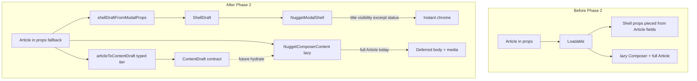

# Create / edit nugget modal — refactor log

## Contracts

- [00-flag-contract.md](./00-flag-contract.md)
- [00-kpi-contract.md](./00-kpi-contract.md)
- [01-data-contract.md](./01-data-contract.md)

## Audit summary (baseline)

- **Create:** `App.tsx` / `WorkspaceHeader` / header open flow; `CreateNuggetModalLoadable` + dynamic `createNuggetModalChunk` preload.
- **Edit:** Most routes pass in-memory `Article` as `initialData`; **admin nuggets** still block on `getArticleById` before modal (unchanged in Phase 1).
- **Flags:** `VITE_FEATURE_NUGGET_MODAL_CHUNK_PRELOAD`, `VITE_NUGGET_MODAL_PRELOAD_ROLLOUT_PCT`, `VITE_FEATURE_NUGGET_MODAL_EDITOR_LAZY`, `VITE_NUGGET_MODAL_CTP_BUDGET_WARN_MS` via `src/config/nuggetPerformanceConfig.ts`.
- **Guards:** `npm run test:perf-guards` (chunk cache + rollout + markdown slim); e2e `tests/e2e/perf-guards-nugget-modal.spec.ts` asserts no duplicate `CreateNuggetModal` chunk fetch on second open.

## Phase 1 — Thin shell + spinner-first fix (done)

**Goal:** Paint modal chrome (backdrop, header, title, visibility, footer) immediately; load `NuggetComposerContent` async with skeleton.

**Implementation:**

- `src/components/modals/NuggetModalShell.tsx` — `ModalShell`, header, title input, excerpt placeholder copy + skeleton, public/private toggles, `FormFooter` (attach + draft/publish). `interactionDisabled` until composer reports ready.
- `src/components/CreateNuggetModalLoadable.tsx` — orchestrates shell state (`shellTitle`, `shellVisibility`), wires `ref` to composer for submit/file/visibility side-effects, Suspense + `NuggetComposerBodySkeleton`, moves **CTP** double-rAF warning here (same env + message as before).
- `src/components/NuggetComposerContent.tsx` — former body of `CreateNuggetModal.tsx` (lazy chunk); no outer `ModalShell`; title/visibility driven from shell props; `useImperativeHandle` for submit + file input + title/visibility side-effects.
- `src/components/CreateNuggetModal.tsx` — thin re-export to preserve `import('./CreateNuggetModal')` / chunk naming and preload URLs.
- `src/components/CreateNuggetModal/FormFooter.tsx` — `interactionDisabled` for preload gap.

**ShellDraft note:** Title + visibility are orchestrated from `CreateNuggetModalLoadable` today, still hydrated from full `initialData` / `prefillData` and composer init. Narrow `ShellDraft` types belong in Phase 2 per `01-data-contract.md`.

## Phase 2 — `ShellDraft` + `ContentDraft` boundary (done)

**Goal:** Shell paints from a **minimal summary type** only; full `Article` remains the integration fallback for `NuggetComposerContent` (image manager, normalize, save) until `AdvancedDetail` split.

**Types & mappers**

- `src/components/modals/shellDraft.ts` — `ShellDraft` (id, title, excerpt, status, visibility, optional `coverImageUrl`), `ContentDraft` (content, tags, tagIds), `shellDraftFromModalProps`, `articleToShellDraft`, `articleToContentDraft`, `emptyShellDraft`.

**Flow**

- `CreateNuggetModalLoadable` maps `initialData` / `prefillData` → `ShellDraft` on each mount (inner unmounts when the modal closes, so shell state resets without a sync `useEffect`). **`ContentDraft`** + `articleToContentDraft` live in `shellDraft.ts` for the deferred tier; the lazy composer still receives full **`initialData` / `prefillData`** in Phase 2 until an AdvancedDetail-only open path exists.
- `NuggetModalShell` accepts **`shellDraft` + `onShellDraftPatch`** only for chrome fields (no `Article` prop). Excerpt is a real optional field; empty excerpt on save still uses `generateExcerpt` in `normalizeArticleInput` unless `excerptOverride` is non-empty.
- `NuggetComposerContent` still receives **full `initialData` / `prefillData`** and **`shellExcerpt`** for `excerptOverride` on normalize.

**Before / after (data flow)**

## Phase 3 — `ContentDraft`-first composer hydration (done)

**Goal:** Prefer the narrow **`ContentDraft`** slice for initial **body + dimension tag ids**; keep **full `Article`** for media, URLs, layout, collections, and save/normalize until `AdvancedDetail` is fetched independently.

**Current transitional source order (precedence)**

| Layer | Source of truth | Used for |
|--------|-----------------|----------|
| Shell | **`ShellDraft`** (from loadable) | Title, excerpt, visibility, status chrome, cover thumb |
| Composer “light” | **`ContentDraft`** (from loadable, or derived via `articleToContentDraft` fallback) | Initial `content`, `dimensionTagIds` (with Article fallback if draft body/tags empty) |
| Composer “heavy” | **Full `Article`** (`initialData` / `duplicatePrefillArticle`) | `useImageManager`, URL/link preview, external links, layout visibility, stream, disclaimer, collections, submit payloads |

**Implementation notes**

- `CreateNuggetModalLoadable` passes **`contentDraft={articleToContentDraft(...)}`** into the lazy composer.
- First-time form init **does not** call `onShellTitleChange` / `onShellVisibilityChange` from article rows (shell is already aligned from `ShellDraft`).
- **`imageManager.syncFromArticle`** runs inside a **nested `startTransition`** after lighter state is set so React can commit shell + text fields first.
- **Phase 3 admin:** still out of scope (no shell-first admin).

**Tests:** `src/components/modals/__tests__/shellDraft.test.ts` — mapper contracts.

## Next tasks (ordered)

1. Reduce duplicated warning (title shell + editor panel) if UX feels noisy.
2. **AdvancedDetail** fetch inside deferred islands; optional open with only `ShellDraft` + `ContentDraft` in props (drop `Article` from loadable when cache/summary APIs exist).
3. **Admin path:** shell-first from admin table row `ShellDraft` while `getArticleById` loads **AdvancedDetail** (see blockers below).
4. Optional: Playwright timing budgets once shell metrics are stable.

### Remaining blockers before admin shell-first open

- **Row → `ShellDraft` mapping:** admin table must expose the same summary fields as `ShellDraft` (or an API returns them without full media graph).
- **`AdvancedDetail` merge:** when `getArticleById` (or equivalent) returns full article, merge into composer without resetting user shell edits unless explicit refresh.
- **Auth / permissions:** admin-only fields (`customCreatedAt`, moderation) stay on **AdvancedDetail** path only.
- **Error UX:** load failure on detail should keep shell open with inline errors in deferred panels (`01-data-contract.md`).

### Dual-source risks (Phase 3)

- **`content` / `tagIds`:** `ContentDraft` vs `Article` — transitional fallback when draft slice is empty; prefer keeping loadable as single producer of `ContentDraft` from the same `Article` used for heavy hydration to avoid drift.
- **Shell vs article:** title/visibility/excerpt remain edited in shell; composer must not re-push article title/visibility on init (guarded in Phase 3).
- **`resolvedContentDraft` identity:** effect depends on memoized draft; spurious object churn from parents could theoretically retrigger init — `initializationKey` limits reruns to the article id.

## Bundle snapshot (after Phase 1, `npm run build`)

Raw bytes from one local Vite 7 build (hashes will differ per build):

| Output | Bytes (raw) | Notes |
|--------|-------------|--------|
| `CreateNuggetModalLoadable-*.js` | ~17 330 | Shell + orchestration (loads with parent lazy boundary). |
| `CreateNuggetModal-*.js` | ~129 910 | Composer body (budget check still uses this file pattern). |
| `createNuggetModalChunk-*.js` | ~2 200 | Preload helper chunk. |

**Before (prior single load):** one `CreateNuggetModal-*.js` chunk (~similar total to shell+composer combined, but **full** modal including chrome had to download before any paint).

Risks for ShellDraft / ContentDraft: see **Phase 3** dual-source notes; shell init no longer overwrites title/visibility from article on composer mount.
